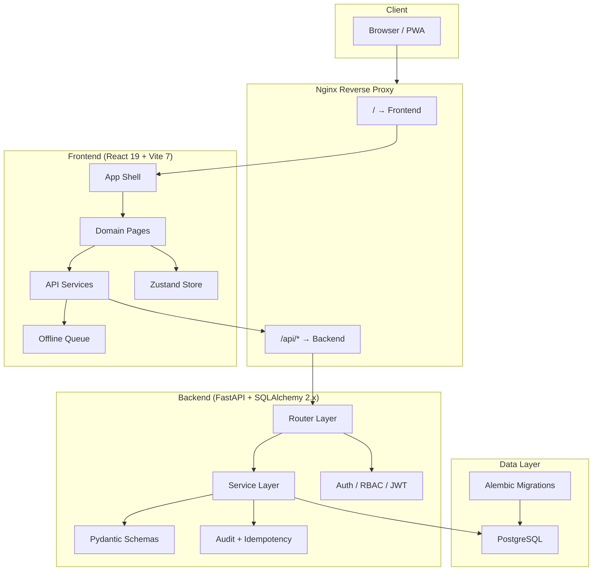
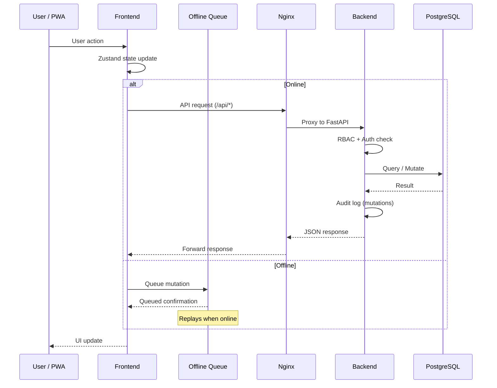

# ARCHITECTURE.md

> Quick-reference architecture overview for LLM agents and developers.

## System Overview

## Key Boundaries

| Boundary | Rule |
|---|---|
| Frontend → Backend | All API calls go through `frontend/src/services/*` |
| Router → Service | Routers are orchestration only; business logic lives in services |
| Schema ↔ Types | `backend/app/schemas/*` must stay in sync with `frontend/src/types.ts` |
| Mutations | Must have RBAC check + audit log + idempotency (`X-Client-Operation-Id`) |
| Offline | All mutations queue through `offlineQueue.ts` when offline |

## Module Map

### Backend (`backend/app/`)

| Layer | Path | Purpose |
|---|---|---|
| Entrypoint | `main.py` | FastAPI app setup, middleware, startup |
| Routers | `routers/*.py` | HTTP endpoints, request validation |
| Services | `services/*.py` | Business logic, DB queries |
| Schemas | `schemas/*.py` | Pydantic models (API contract) |
| Models | `models/*.py` | SQLAlchemy ORM models |
| Auth | `dependencies.py` | JWT decode, RBAC guards |
| Migrations | `alembic/versions/*.py` | DB schema changes |

### Frontend (`frontend/src/`)

| Layer | Path | Purpose |
|---|---|---|
| Shell | `App.tsx`, `AppLayout.tsx` | Routing, layout, auth gate |
| Pages | `pages/*.tsx` | Domain UI containers (<350 LOC) |
| Services | `services/*.ts` | Axios-based API clients |
| Types | `types.ts`, `types/*.ts` | TypeScript interfaces |
| Routing | `routing/*.ts` | Route definitions, access control |
| Store | `stores/*.ts` | Zustand state management |
| Offline | `offlineQueue.ts` | Mutation queue for PWA |

## Tech Stack

| Layer | Technology | Version |
|---|---|---|
| Frontend framework | React | 19 |
| Build tool | Vite | 7 |
| Styling | Tailwind CSS | 4 |
| State | Zustand | 5 |
| Data fetching | TanStack Query | 5 |
| Backend framework | FastAPI | latest |
| ORM | SQLAlchemy | 2.x |
| Database | PostgreSQL | latest |
| Migrations | Alembic | latest |
| Reverse proxy | Nginx | latest |
| Testing (FE) | Vitest + Playwright | latest |
| Testing (BE) | pytest | latest |
| Container | Docker Compose | latest |

## Data Flow

## Agent Navigation

For quick navigation, use these resources:
- **Entrypoints**: `docs/agents/entrypoints/*.md` — per-module navigation
- **Repo index**: `docs/agents/repo-index.json` — machine-readable file map
- **Context packs**: `docs/agents/context-packs/*.md` — domain context bundles
- **Repo map**: `docs/agents/repo-map.md` — structural overview
- **Workflows**: `.agents/workflows/*.md` — step-by-step recipes
