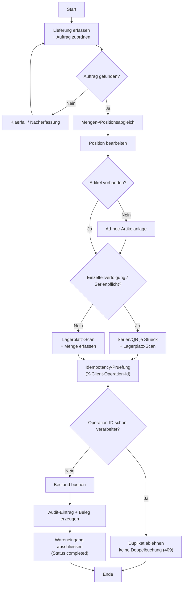

# Wareneingang - Ablaufdiagramm

## Anleitung: Ablauf im Detail

### 1. Wofuer ist dieser Ablauf?
- Sie erfassen eine eingetroffene Lieferung (Wareneingang) und buchen sie auf einen Lagerplatz ein.
- Nach dem Abschluss ist die Ware im Bestand sichtbar und der Beleg ist nicht mehr editierbar.

### 2. Kurzueberblick (3 Schritte)
1. Beleg anlegen (optional mit Auftrag).
2. Positionen erfassen (Scanner-Workflow oder manuell).
3. Beleg abschliessen (bucht Bestand).

### 3. Schritt-fuer-Schritt fuer Anwender
1. Beleg anlegen:
   - In `1. Beleg anlegen` optional einen Auftrag in `Bestellauftrag` auswaehlen.
   - Optional `Warenlieferant` und `Notiz` eintragen.
   - Auf `Neu` klicken.
2. Positionen erfassen:
   - Variante A: `2. Scanner-Workflow` (schnell fuer Standardartikel)
     - `Artikel scannen (QR/EAN)`
     - `Menge erfassen`
     - `Lagerplatz scannen`
     - `Position bestaetigen`
   - Variante B: Manuell (gut fuer Seriennummern / Sonderfaelle)
     - `Artikel waehlen`
     - Lagerort waehlen: Lager -> Zone -> Platz
     - `Menge` eintragen
     - Falls Seriennummernpflicht: Seriennummern eingeben (eine pro Zeile oder komma-separiert)
     - `Position hinzufuegen`
3. Wareneingang abschliessen:
   - Pruefen, ob alle Positionen rechts unter `3. Erfasste Positionen` vorhanden sind.
   - Auf `Abschliessen` klicken.

### 4. Wenn ein Auftrag verknuepft ist
- In der Auswahl sehen Sie den Auftrag mit Status in Klammern.
- Zulaessig sind nur Auftraege, die fuer Wareneingang freigegeben sind (typisch: `ordered` oder `partially_received`).
- Bei Auftragsbezug muessen die erfassten Artikel zum Auftrag passen (sonst bekommen Sie eine Meldung).

### 5. Seriennummernpflicht (Einzelteilverfolgung)
- Bei Artikeln mit Seriennummernpflicht muessen Seriennummern erfasst werden.
- Die Anzahl der Seriennummern muss exakt der Menge entsprechen.
- Die Menge muss eine ganze Zahl sein (keine Dezimalwerte).
- Nach dem Erfassen koennen Sie ueber `Labels drucken` Etiketten ausgeben.

### 6. Was passiert beim Abschliessen?
- Der Bestand wird auf den gewaehlten Lagerplaetzen erhoeht.
- Falls ein Auftrag verknuepft ist, aktualisiert das System den Status automatisch (teilweise oder vollstaendig geliefert).
- Der Belegstatus wechselt von `draft` (offen) auf `completed` (abgeschlossen).

### 7. Was bedeuten die Hauptbuttons?
- `Neu`: Neuen Wareneingangsbeleg anlegen.
- `Position hinzufuegen` / `Position bestaetigen`: Position zum Beleg hinzufuegen.
- `Abschliessen`: Beleg final buchen (danach keine Aenderungen mehr).
- `Stornieren`: Beleg abbrechen (nur solange er offen ist).
- `Loeschen`: Offenen Entwurf loeschen.
- `Labels drucken`: Etiketten fuer Seriennummern ausgeben.

### 8. Haeufige Meldungen und was zu tun ist
- "Noch keine Positionen erfasst." / "Keine Positionen erfasst":
  - Erst mindestens eine Position hinzufuegen, dann abschliessen.
- "Anzahl Seriennummern muss der Menge entsprechen":
  - Seriennummern ergaenzen oder Menge korrigieren.
- "Getrackte Artikel erfordern eine ganze Menge":
  - Ganze Stueckzahl eingeben (z. B. `3` statt `3.0` oder `0.5`).
- "Keine passende Auftragsposition gefunden":
  - Pruefen, ob der richtige Auftrag gewaehlt ist und der Artikel im Auftrag enthalten ist.
- "Lieferant passt nicht zum Auftrag":
  - Lieferant im Beleg anpassen oder den richtigen Auftrag auswaehlen.

### 9. Hinweise
- Wenn ein Button fehlt oder gesperrt ist, liegt es meist daran, dass der Beleg nicht mehr offen ist oder Ihnen die Berechtigung fehlt.
- Mehrfachklicks auf Aktionen fuehren nicht zu Doppelbuchungen; das System verhindert das.
