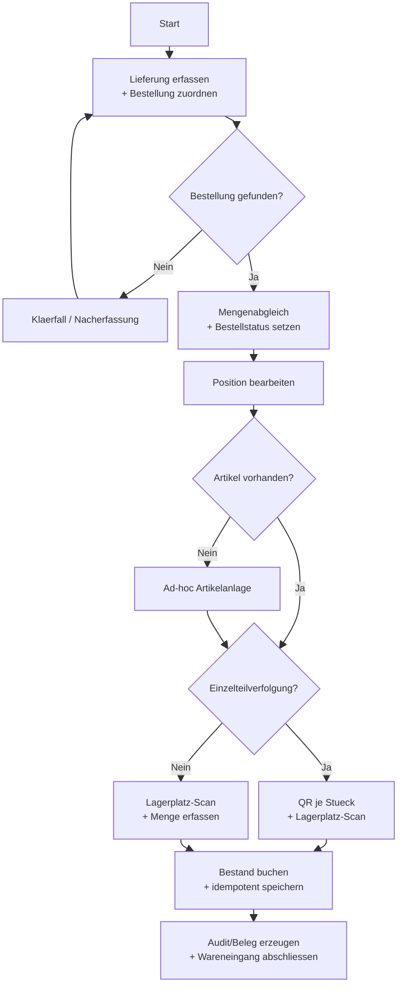

# Wareneingang 

```mermaid
%%{init: {'themeVariables': {'fontSize': '10px'}, 'flowchart': {'nodeSpacing': 11, 'rankSpacing': 13, 'diagramPadding': 3}}}%%
flowchart TB
    A["Start"] --> B["Lieferung erfassen<br/>+ Bestellung zuordnen"]
    B --> C{"Bestellung gefunden?"}
    C -- "Nein" --> C1["Klaerfall / Nacherfassung"] --> B
    C -- "Ja" --> D["Mengenabgleich<br/>+ Bestellstatus setzen"]

    D --> E["Position bearbeiten"]
    E --> F{"Artikel vorhanden?"}
    F -- "Nein" --> G["Ad-hoc Artikelanlage"]
    F -- "Ja" --> H
    G --> H{"Einzelteilverfolgung?"}

    H -- "Ja" --> I["QR je Stueck<br/>+ Lagerplatz-Scan"]
    H -- "Nein" --> J["Lagerplatz-Scan<br/>+ Menge erfassen"]

    I --> K["Bestand buchen<br/>+ idempotent speichern"]
    J --> K
    K --> L["Audit/Beleg erzeugen<br/>+ Wareneingang abschliessen"]
```
