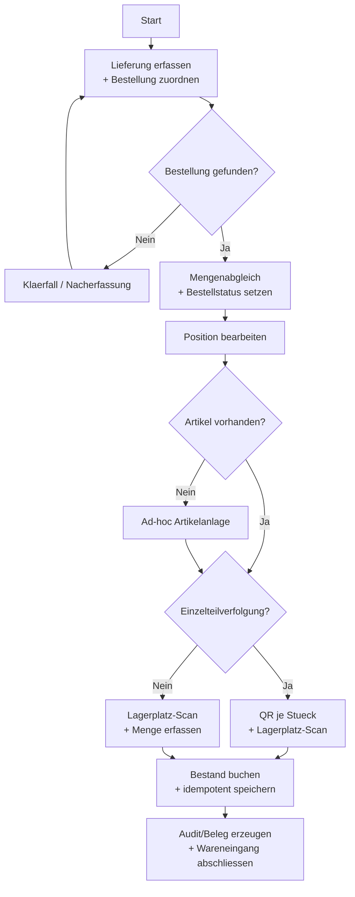
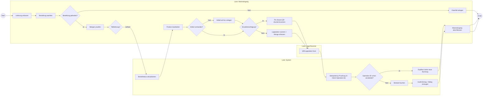

# Wareneingang Prozess - Flowcharts

Diese Note enthaelt zwei Versionen des Wareneingangsprozesses fuer Doku und Schulung.

## 1) Standard Flowchart

```mermaid
%%{init: {'flowchart': {'nodeSpacing': 18, 'rankSpacing': 20}}}%%
flowchart TB
    A["Start"] --> B["Lieferung erfassen<br/>+ Bestellung zuordnen"]
    B --> C{"Bestellung gefunden?"}
    C -- "Nein" --> C1["Klaerfall / Nacherfassung"] --> B
    C -- "Ja" --> D["Mengenabgleich<br/>+ Bestellstatus setzen"]

    D --> E["Position bearbeiten"]
    E --> F{"Artikel vorhanden?"}
    F -- "Nein" --> G["Ad-hoc Artikelanlage"]
    F -- "Ja" --> H
    G --> H{"Einzelteilverfolgung?"}

    H -- "Ja" --> I["QR je Stueck<br/>+ Lagerplatz-Scan"]
    H -- "Nein" --> J["Lagerplatz-Scan<br/>+ Menge erfassen"]

    I --> K["Bestand buchen<br/>+ idempotent speichern"]
    J --> K
    K --> L["Audit/Beleg erzeugen<br/>+ Wareneingang abschliessen"]
```

## 2) BPMN-aehnliches Diagramm

```mermaid
flowchart LR
  S((Start))
  E((Ende))

  subgraph L1["Lane: Wareneingang"]
    direction TB
    A1["Lieferung erfassen"]
    A2["Bestellung waehlen"]
    G1{"Bestellung gefunden?"}
    A3["Klaerfall anlegen"]
    A4["Mengen pruefen"]
    G2{"Teillieferung?"}
    A5["Position bearbeiten"]
    G3{"Artikel vorhanden?"}
    A6["Artikel ad-hoc anlegen"]
    G4{"Einzelteilverfolgung?"}
    A7["Pro Stueck QR drucken/scannen"]
    A8["Lagerplatz scannen + Menge erfassen"]
    A9["Wareneingang abschliessen"]
  end

  subgraph L2["Lane: System"]
    direction TB
    B1["Bestellstatus aktualisieren"]
    B3["Idempotency-Pruefung (X-Client-Operation-Id)"]
    G5{"Operation-ID schon verarbeitet?"}
    B4["Duplikat: keine neue Buchung"]
    B2["Bestand buchen"]
    B5["Audit-Eintrag + Beleg erzeugen"]
  end

  subgraph L3["Lane: Lager/Scanner"]
    direction TB
    C1["QR/Lagerplatz-Scan"]
  end

  S --> A1 --> A2 --> G1
  G1 -- "Nein" --> A3 --> E
  G1 -- "Ja" --> A4 --> G2
  G2 -- "Ja/Nein" --> B1
  B1 --> A5 --> G3
  G3 -- "Nein" --> A6 --> G4
  G3 -- "Ja" --> G4
  G4 -- "Ja" --> A7 --> C1
  G4 -- "Nein" --> A8 --> C1
  C1 --> B3 --> G5
  G5 -- "Ja" --> B4 --> A9 --> E
  G5 -- "Nein" --> B2 --> B5 --> A9 --> E
```
